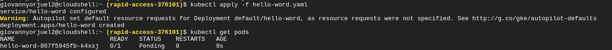

# fast-api-log


- ✨Magic ✨

## Docker

Is very easy to install and deploy in a Docker container.

By default, the Docker will expose port 8000, so change this within the
Dockerfile if necessary. When ready, simply use the Dockerfile to
build the image.

```sh cd fast-api-log_api
docker-compose  build --no-cache .
```

```sh
docker-compose up -d
Creating network "fast-api-log_api" with the default driver
Creating flask-example ... done
```

### Iniciar 


### Deploy 


### Service  


### Logs  
